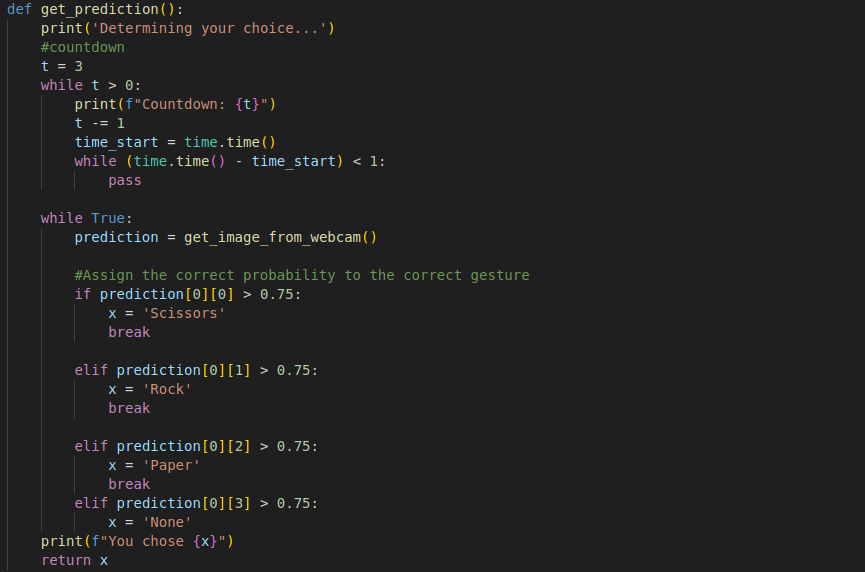
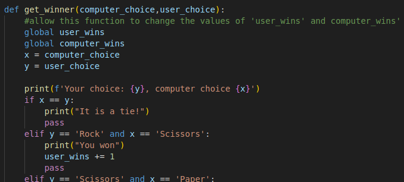
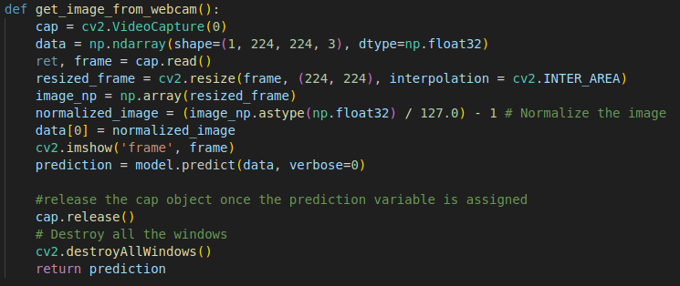
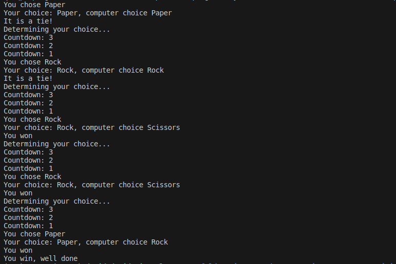
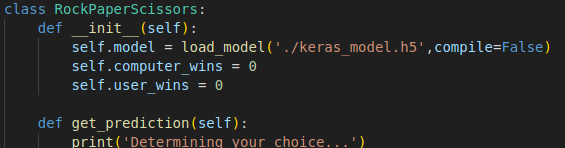
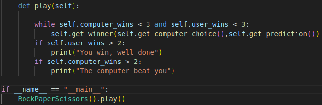

# Computer Vision RPS

## Milestone 2
# Creating the image project model
With GitHub set up, the first thing I needed for my interactive Rock-Paper-Scissors project was an interactive image model that could determine whether the user was showing rock, paper or scissors.
This was simply a matter of recording images and feeding them into Google's 'Teachable Machine' web tool. Since it has the capability to recognise images and assign them to classes, I made the relevant 'rock', 'paper' and 'scissors' hand gestures to the camera and tested it. If the model incorrectly assigned a gesture to a class; a gesture had large amount of uncertainty in a particular position, Teachable Machine allowed me to add additional material for each class. Through this method, I was able to optimize the model to infer the gestures correctly whilst using as little memory as possible.


Using Teachable Machine, I was able to export the model and labels to the repo I had created for the project. The model was exported under the name 'keras_model.h5' and the labels into a file called 'labels.txt'.

## Milestone 3
# Installing the dependencies
In order for the model to work correctly, I created a Python environment in VSCode called 'rockpaperscissors'. I used Python 3.8, since I am using an Ubuntu OS - where the latest version of Tensorflow doesn't work with the default version of Python.


Once I had an environment, I ran 'conda install pip' in the terminal and subsequently used pip to install opencv-python, tensorflow and ipykernel into my environment:


With my environment created, in the terminal, I ran 'pip list > requirements.txt' thus exporting the environment I had just created into a txt file, enabling other users to load the environment from within the repo. 

Initially, when I tested the model, each line was seperated by a progress bar, displaying 1/1. This was not helpful, so I got rid of them by setting the 'verbose' argument to '0' under the 'prediction' variable:


``` prediction = model.predict(data, verbose=0)```


## Milestone 4
# Coding the rules to rock-paper-scissors
The next thing I needed was a Python file containing the logic for the game, this was straightforward enough:


In the code, I imported the 'random' module so that I could use the 'choice()' method for the computer's decision, and used the 'input()' method for the user's decision.
I created separate functions for computer and user input, as well as a third function called 'get_winner()' containing all of the game logic and passing two arguments; 'computer_choice' and 'user_choice'.
Now, when running the code, when the two 'get_x_choice()' functions are passed as arguments to the 'get_winner()' function, the game runs as expected.
As the three functions are all required to play the game, it made sense to pack them all into a function called 'play()'.

## Milestone 5
# Implementing the rules into the game
At this stage I had all of the materials for a functioning game, all I needed to do was make them compatible with each other and debug the finished program.
The bulk of the work, of course, was around the user input function, since this was the most complex as it is taking webcam input, in the place of a simple list combined with the random() method.



As the webcam output assigned to the variable 'prediction' was displayed as a list of probabilities, outputting the correct gesture in string format was simply a matter of assigning the corresponding string to the 'x' variable when the camera model certainty was over a particular threshold(in this case I found around 75% to be the most successful).
I achieved this using if/elif statements.

One milestone requirement at this stage was to include a basic countdown for the user to indicate when they should make their gesture, I wrote this code as a 'while' loop immediately prior to the 'while' loop that captured the user input, avoiding using the 'sleep()' function as it could interfere with the camera user input.

Another of the milestone requirements was to enable the game to count the number of user and computer wins, stop the game once someone had reached three and let the user know whether they had won or lost.
For this, I implemented a basic 'while' loop within the 'play()' function which carried on looping until either the computer or user score reached 3, and also added code into the 'get winner()' function to respectively increase the values of the 'user_wins' and 'computer wins' variables. In order for this to work outside the local scope, it was important to refer both of the variables as 'global' within the 'get_winner()' function.



At this stage, I encountered an issue where the webcam would automatically become inaccessible after the first loop iteration, I was able to overcome this by releasing the 'cap' object and shutting down the camera window after the 'prediction' variable had been assigned within the 'get_image_from_webcam()' function, rather than after the 'while' loop within the 'get_prediction()' function.



The code works as expected!



Finally, in order to tidy the functions into a single object, I packed them as methods into a class called RockPaperScissors. A few things needed to be modified here; after initializing the class and adding 'self' as an argument, I updated all of the methods with the 'self' argument and defined the class attributes as the image model as well as win scores for both the computer and user. 



Making sure to add 'self' to the variables I had used as attributes, I also added execution code under an 'if name equals main' statement so that the code is only run when the 'camera_rps' file is run directly, and won't automatically run if the file is imported.

