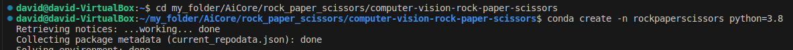
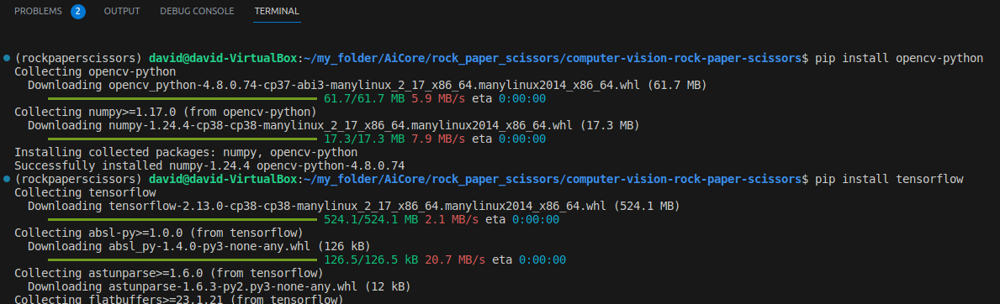
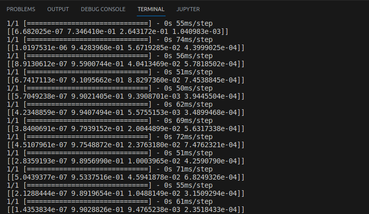
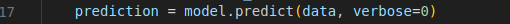
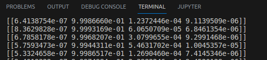
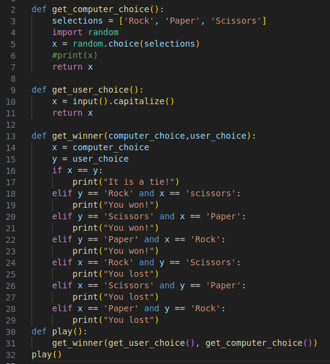

# Computer Vision RPS

## Milestone 2
# Creating the image project model
With GitHub set up, the first thing I needed for my interactive Rock-Paper-Scissors project was an interactive image model that could determine whether the user was showing rock, paper or scissors.
This was simply a matter of recording images and feeding them into Google's 'Teachable Machine' web tool. Since it has the capability to recognise images and assign them to classes, I made the relevant 'rock', 'paper' and 'scissors' hand gestures to the camera and tested it. If the model incorrectly assigned a gesture to a class; a gesture had large amount of uncertainty in a particular position, Teachable Machine allowed me to add additional material for each class. Through this method, I was able to optimize the model to infer the gestures correctly whilst using as little memory as possible.

Using Teachable Machine, I was able to export the model and labels to the repo I had created for the project. The model was exported under the name 'keras_model.h5' and the labels into a file called 'labels.txt'.

## Milestone 3
# Installing the dependencies
In order for the model to work correctly, I created a Python environment in VSCode called 'rockpaperscissors'. I used Python 3.8, since I am using an Ubuntu OS - where the latest version of Tensorflow doesn't work with the default version of Python.

Once I had an environment, I ran 'conda install pip' in the terminal and subsequently used pip to install opencv-python, tensorflow and ipykernel into my environment:

With my environment created, in the terminal, I ran 'pip list > requirements.txt' thus exporting the environment I had just created into a txt file, enabling other users to load the environment from within the repo. 

Initially, when I tested the model, each line was seperated by a progress bar, displaying 1/1. This was not helpful, so I got rid of them by setting the 'verbose' argument to '0' under the 'prediction' variable:

## Milestone 4
# Coding the rules to rock-paper-scissors
The next thing I needed was a Python file containing the logic for the game, this was straightforward enough:

In the code, I imported the 'random' module so that I could use the 'choice()' method for the computer's decision, and used the 'input()' method for the user's decision (making sure to also use the 'capitalize()' method to standardize the user input)
I created separate functions for computer and user input, as well as a third function called 'get_winner()' containing all of the game logic and passing two arguments; 'computer_choice' and 'user_choice'.
Now, when running the code, when the two 'get_x_choice()' functions are passed as arguments to the 'get_winner()' function, the game runs as expected.
As the three functions are all required to play the game, it made sense to pack them all into a function called 'play()'.

