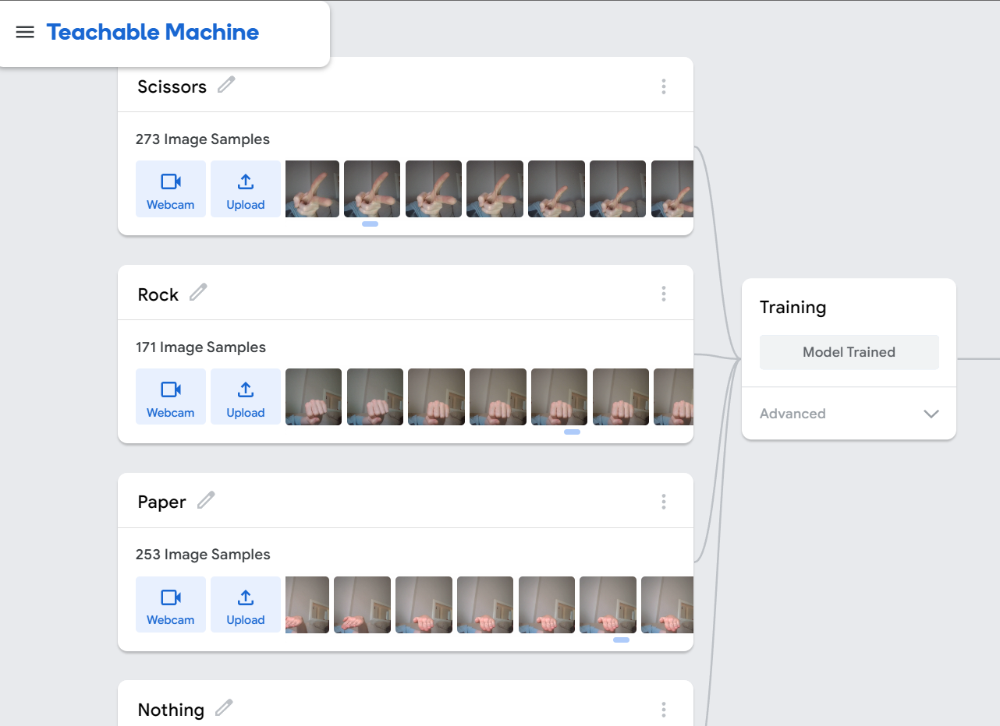

# Computer Vision RPS
## Milestone 1
# Creating the image project model
The first thing I needed for my interactive Rock-Paper-Scissors project was an interactive image model that could determine whether the user was showing rock, paper or scissors.
This was simply a matter of recording images and feeding them into Google's 'Teachable Machine' web tool. Since it has the capability to recognise images and assign them to classes, I made the relevant 'rock', 'paper' and 'scissors' hand gestures to the camera and tested it. If the model incorrectly assigned a gesture to a class; a gesture had large amount of uncertainty in a particular position, Teachable Machine allowed me to add additional material for each class. Through this method, I was able to optimize the model to infer the gestures correctly whilst using as little memory as possible.

